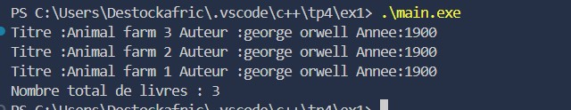
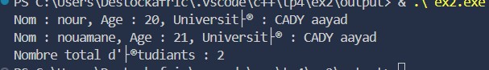

# TP C++ – Exercices Divers

## Exercice 1 : Suivi des Livres dans une Bibliothèque

### Description
Ce projet simule la gestion d’un catalogue de livres en C++.  
La classe `Livre` permet de stocker le **titre**, l’**auteur** et l’**année de publication** d’un ouvrage.  
Un **compteur statique** suit le nombre total de livres créés, et les informations de chaque livre peuvent être affichées individuellement.

### Fonctionnalités
1. **Création des livres**
   - Définir les informations d’un livre avec le constructeur.
2. **Affichage**
   - Afficher les informations d’un livre.
   - Afficher le nombre total de livres créés.

### Capture du `main`

### Résultats du programme
Le programme affiche les informations complètes de chaque livre ajouté au catalogue, ainsi que le nombre total de livres.  

---

## Exercice 2 : Gestion des Étudiants et de l’Université

### Description
Ce projet illustre l’association entre deux classes en C++ : `Etudiant` et `Universite`.  
Chaque étudiant est lié à une université et un **compteur statique** permet de suivre le nombre total d’étudiants créés.

### Fonctionnalités
1. **Création des universités et étudiants**
   - Créer une université.
   - Créer un étudiant associé à cette université.
2. **Affichage**
   - Afficher les informations d’un étudiant.
   - Afficher le nombre total d’étudiants créés.

### Résultats du programme
Le programme affiche les informations de chaque étudiant et le nombre total d’étudiants créés.  

